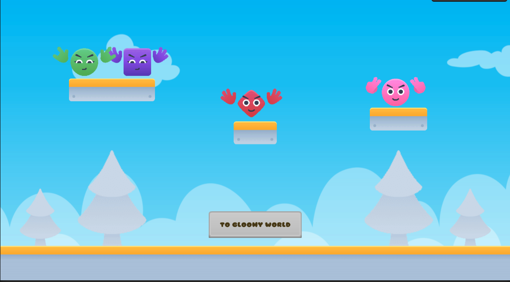

# TechDesignTestProject

Тестовое задание для Elephant Games от соискателя Михаила Жиркова.

Сцена 1 - Happy world

При нажатии на персонажей на экране проигрывается анимация, а также звуковое сопровождение.
При нажатии на кнопку To Gloomy World происходит переход на сцену 2 (Персонажи переносятся в мир печали).

Сцена 2 - Gloomy World

При нажатии на персонажей на экране аналогично проигрывается анимация, а также звуковое сопровождение.
При нажатии на кнопку To Happy World происходит переход на сцену 1 (Персонажи снова переносятся в мир счастья)

Комментарии по выполнению тестового задания:
1. При выполнении задания я исходил из подхода быстрого воспроизведения схожих сцен (fast recreate) - так, например, при создании персонажей был использован базовый prefab с заранее расставленными пресетами дочерних объектов и скриптом, отвечающим за анимацию, а не создавать каждый подобный объект повторно, из которого позднее и создавались его варианты.
Помимо этого каждый объект был создан в качестве префаба и лишь затем помещен на сцену.
3. Помимо этого были созданы родительские префабы с вложенными префабами для быстрой настройки сцен (родительский префаб с набором персонажей по сценам, родительский префаб с окружением, бэкграундом.
4. На выполнение задания вместо с продумыванием концепции и поиском ассетов у меня ушел примерно 1 день.
